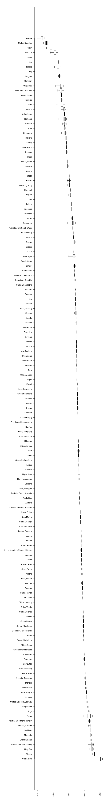
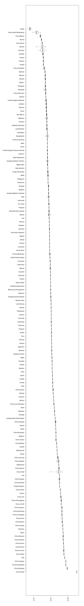
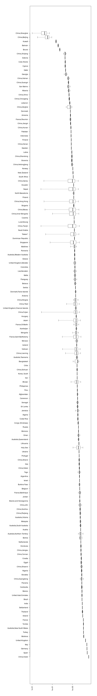
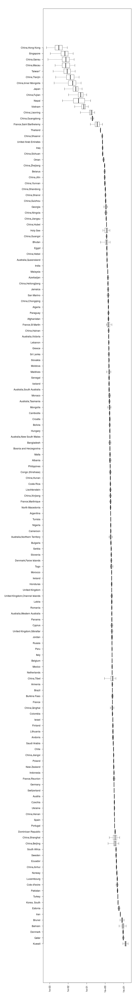
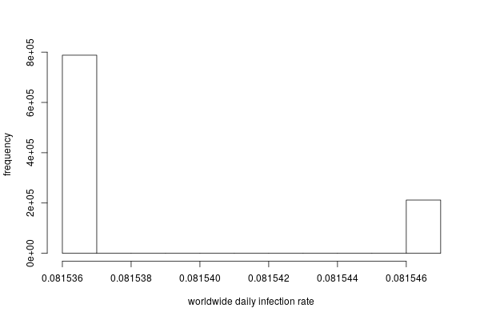

# Supplementary methods

||
|:--:|
|Fig. 3: parametet $h$ per country|

||
|:--:|
|Fig. 4: infection rate the 22nd of Jan 2020|

||
|:--:|
|Fig. 5: time of intervention per country|

||
|:--:|
|Fig. 6: parameter $k$ per country|

||
|:--:|
|Fig. 7: Posterior distribution of the daily infection rate $\lambda$|

