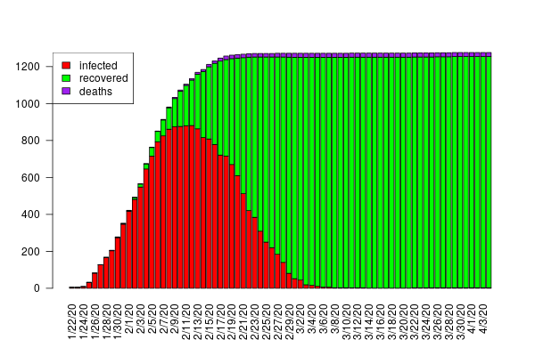
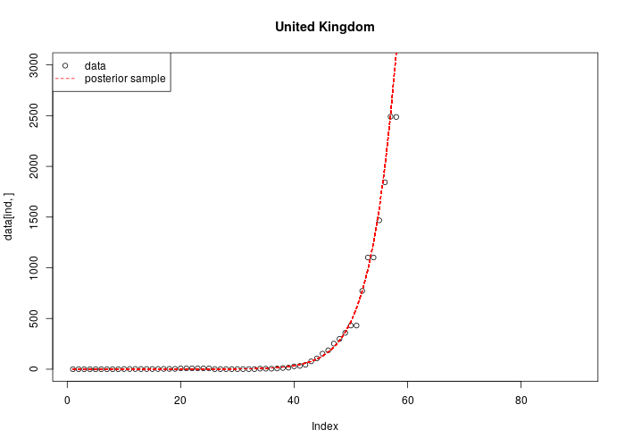
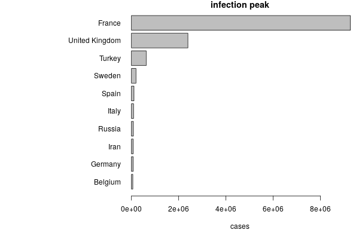
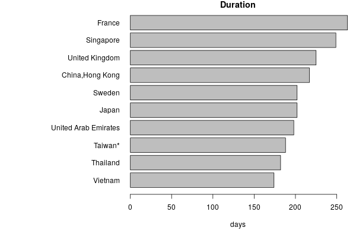



 **Giovanni Diana**$^1$ and **Diana Passaro**$^2$

$^1$ Center for Developmental Neurobiology & MRC Center for Neurodevelopmental Disorders, King’s College London, Guy’s Hospital Campus, London, United Kingdom

$^2$ Leukemia and Niche Dynamics Laboratory, Cochin Institute, 27 rue du Faubourg Saint Jacques, 75014 Paris, France

***

* [Summary of the outbreak by country](current_state)
* [Supplementary Methods](SM)

***

## Introduction 
Spread of COVID-19 in early 2020 has raised important concerns about the ability of national health systems to detect the positive cases, as well as the intervention rate a country is expected to put in place to contain the infection.

  Using data on disease spread and containment through the public repository [CSSEGISandData/COVID-19](https://github.com/CSSEGISandData/COVID-19) we established a predictive model to estimate the outbreak of the infection in a given population. 

In some regions of China the infection rate has significantly decreased compared to the initial exponential spread of the infection. This information can be used to build predictive models which can help other countries to estimate the extent of the outbreak.  
First we modeled the number of infections over time based on the disease outbreak in China. Our model captures the initial exponential phase of the outbreak and the effect of the external intervention to contain the infection. Thus the exponential phase termimnates with a peak of maximum rate of new infected cases and then is followed by a critical period where the number of infections can decrease if the intervention remains stable. Below we show the dynamics of the infection in two areas in which the outbreak is contained (top) or in the exponential phase (bottom).

<figure>
   

   <figcaption> Figure 1a: Dynamics of the infection in the Henan province, China (last update 14/02/2020) </figcaption>

</figure>

<figure>
   

   <figcaption> Figure 1b: Dynamics of the infection in Italy (last update 14/02/2020) </figcaption>

</figure>

## The model
We used a generative model to describe the dynamics of the infected population in a given geographic area. Our model takes into account the effect of the local interventions by coupling the average number of infections $$X(t)$$ with a dynamical variable $$A(t)$$ which acts against the spread. The observed number of cases is then generated from a Poisson distribution with rate $X(t)\cdot p(t)$, where $p(t)$ is a fraction of the true number of infections which varies over time (due for instance to the increased number of tests during the acute phase).

The model is defined by two differential equations for the size of the infected population $X(t)$ and the action $A(t)$ and a probabilistic rule on the observed infections 

$$
\begin{align*}
\frac{dX}{dt} &= (\lambda-A(t))\cdot X(t),\quad X(t_0) = X_0\\
\frac{dA}{dt} &= h X(t)p(t),\quad A(t_0)=0\\
n(t) & \sim \mathrm{Poisson}(X(t) \cdot p(t)),\quad p(t)=\frac{1}{1+\left(\frac{k}{X(t)}\right)^g}
\end{align*}
$$ 

where $\lambda$ is the (observed) infection rate and $h$ quantifies the effect of local interventions.  
$X_0$ is the average number of infections at the initial time (22/01/2020).
The lack of observations at early stages is captured by the factor $p(t)$ which depends directly on the daily infection rate. The assumption being that the more infections are detected the more tests and controls are put in place to monitor the infected population. Note however that this is not sufficient to estimate the true number of infected individual, but to accommodate the low number of observations when the epidemics reaches a given country.

Figure 2 illustrates the typical dynamics of the model.

<figure>

<figcaption> Figure 2: Dynamics of the number of infections</figcaption>
</figure>

|name |	description|
|:----|-----------:|
|$h$ |	intervention coefficient|
|$k$ |	Hill scale|
|$g$ |	Hill shape|
|$\lambda$ |	global infection rate|
|$X_0$ |	initial infected|
|$X(t)$ |	infected at time t|
|$A(t)$ | intervention strength|
|$p(t)$ |	observed fraction of infected individuals|

Table 1: Summary of parameters and variable used in the model.

Of particular importance, the intervention coefficient $h$ describes the investment the country is putting in place to contain the epidemy (plotted in Supplementary figure 1). Linked to this parameter, the hill scale can be calculated for each country (Supplementary figure 3), and together with the hill shape $k$ (Supplementary figure 4) is indicative of the readiness of the country to put in place a containment programme.  

## Statistical inference and model predictions
By using the available daily reported cases in the public repository [CSSEGISandData/COVID-19](https://github.com/CSSEGISandData/COVID-19) we can estimate the parameters of the model from the data for each country/region affected by the infection (see current state [here](current_state)). Knowing the model parameters allow us to draw predictions on how the epidemics will evolve. 

### Parameter estimation in individual areas
The framework of Bayesian statistics allows us to estimate the parameters of our model and their uncertainty by targeting their posterior distributions, namely their probability density conditional to the observed data. The uncertainty in the parameters propagates to the predicted dynamics of the infection, giving a way to explore the scenarios which are statistically compatible with the data. 

Here we used the Markov-chain monte carlo (MCMC) approach which allows us to draw posterior samples of the parameters. We can apply this method to individual countries affected by COVID-19 outbreak and extract country-specific model parameters as shown below in the case of the UK, where no specific interventions have been applied to date. As a consequence, the exponential phase generates a pronounced uncertainty in the model prediction of the future number of infected individuals. 

<figure>

<figcaption> Curves generated from 100 posterior samples of model parameters obtained by using data from the UK.</figcaption>

</figure>

  

### Worldwide analysis 
For this analysis we assume that the rate of infection $\lambda$ is the same for all countries whereas all the other model parameters are country-dependent. This allows us to exploit the worldwide data to strengthen the predictive power of the model.

The framework of statistical inference allows us to estimate the model parameters and make predictions while taking into account statistical uncertainties derived from the data and the prior uncertainty. We performed a global analysis on the areas included in the CSSE dataset [1].

The interactive chart below gives an overview of the course of the infection for each country. Data are updated every day.

<iframe width="800" height="400" frameborder="0" scrolling="no"
src="notebooks/plotly_chart.html"></iframe>

While China is now at the final stage of the spread, several countries in Europe are now facing the exponential phase. By quantifying the number of infected individual at the peak predicted by our model we found that Italy, Germany, France and Iran are at high risk of pandemic spread. During the exponential phase it is really hard to draw reliable estimates of when the diffusion of the virus will start displaying a reduction, therefore it is extremely important for these countries to strenghten the interventions to contain the eponential increase of new cases.  

<figure>

<figcaption> Fig. 3: Top 10 countries for maximum number of infected individuals</figcaption>

</figure>

<figure>

<figcaption> Fig. 4: Top 10 countries by duration of the outbreak</figcaption>

</figure>

The intervention coefficient is estimated from each country from the data and is a fundamental parameter to bring down the peak of infected individuals, as it is shown by testing different values of $h$ from the estimated one.

<figure>

<figcaption> Fig. 5: Effect of changing the intervetion coefficient on the Henan dataset.</figcaption>

</figure>

## Inference on the SIR model 
In this section we introduce the SIR model to describe susceptible, infected and recovered individuals in a population. The intervention is accounted in two ways, first by reducing the infection rate $\beta$, and second by increasing the recovery rate $\gamma$. The first effect is due to restriction in social activity, reducing the probability of being infected, the second is due to the treatment of patients in hospitals which might improve over time.  
The model is characterized by the following population dynamics

$$
\begin{align*}
\frac{dI}{dt} &= \frac{\beta(t)}{N}\cdot S(t)I(t)-\gamma(t)\cdot I(t),\quad I(t_0) = I_0\\
\frac{dS}{dt} &= -\frac{\beta(t)}{N}\cdot S(t)I(t),\quad S(t_0) = N\\
\frac{dR}{dt} &= \gamma(t)\cdot I(t),\quad R(t_0)=0
\end{align*}
$$ 

where $S$, $I$ and $R$ are the susceptible, infected and recovered population respectively. In order to include the effect of the intervention we parameterized the time dependency of the infection rate $\beta$ and the recovery rate $\gamma$ using the Hill functions

$$
\begin{align*}
\beta(t) &= \beta_0\cdot\left(1+\frac{h}{1+(k/t)^g}\right)^{-1}\\
\gamma(t) &= \gamma_0\cdot\left(1+\frac{h_R}{1+(k_R/t)^{g_R}}\right)
\end{align*}
$$

Note that the main difference with respect to the empirical model described in the previous section where the intervention had its own dynamical equation whereas here the time dependency is entirely modeled by the Hill functions.
To include the effect of introducing tests for COVID-19 infection we modeled the observed numbers of infections and recovery as

$$
\begin{align*}
I^{obs}(t)&=\nu(t) I(t)\\
R^{obs}(t)&=\nu(t) R(t)
\end{align*}
$$

with 

$$
\begin{align*}
\nu(t)=\frac{\nu_\infty}{1+(k_T/t)^{g_T}}
\end{align*}
$$

|name |	description|
|:----|-----------:|
|$S$ |	Susceptible population|
|$I$ |  Infected population |
|$R$ |  Recovered population |
|$\beta$ | time-dependent infection rate|
|$\gamma$ | time-dependent recovery rate |
|$\nu$ | Observed fraction of cases |

Table 2: Summary of parameters and variable used in the SIR model.

<figure>

<figcaption> Fig. 6: Fit of the SIR model and comparison with the Henan data.</figcaption>

</figure>

<figure>

<figcaption> Fig. 7: Effect of changing the intervetion coefficient on the Henan dataset in the SIR model.</figcaption>

</figure>

Here is an interactive figure showing the dynamics of the infected population according to the SIR model in all countries

<iframe width="800" height="400" frameborder="0" scrolling="no"
src="notebooks/plotly_chart_sir.html"></iframe>

## References
1. Dong, Ensheng, Hongru Du, and Lauren Gardner. "An interactive web-based dashboard to track COVID-19 in real time." The Lancet Infectious Diseases (2020).   

